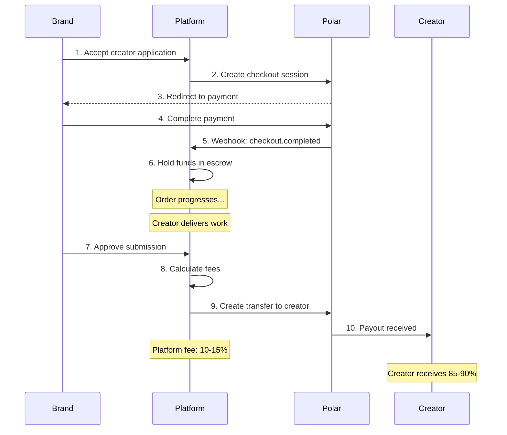

# Technical Architecture for UGC Creator Platform

## Overview

This document outlines the technical architecture for the UGC Creator Platform, built with:

- **Mobile + Web App**: Expo Native with Expo Native Web
- **Admin Dashboard**: Next.js
- **Backend**: Convex (real-time sync, queries, mutations)
- **Authentication**: BetterAuth with Convex
- **Payments**: Polar (subscriptions + escrow)

Reference architecture: `/Users/sigex/gruckion-workdir/convoexpo-and-nextjs-web-bun-better-auth`

---

## 1. Monorepo Structure

```text
ugc/
├── apps/
│   ├── native/                    # Expo Native app (Brands + Creators)
│   │   ├── app/                   # Expo Router file-based routing
│   │   │   ├── (auth)/            # Authentication screens
│   │   │   ├── (tabs)/            # Main tab navigation
│   │   │   │   ├── (brand)/       # Brand-specific screens
│   │   │   │   ├── (creator)/     # Creator-specific screens
│   │   │   │   └── profile/       # Shared profile screens
│   │   │   └── _layout.tsx        # Root layout with providers
│   │   ├── components/            # Native UI components
│   │   ├── lib/                   # Client-side utilities (auth-client, etc.)
│   │   ├── hooks/                 # Custom React hooks
│   │   ├── contexts/              # React context providers
│   │   └── assets/                # Images, fonts, etc.
│   │
│   └── web/                       # Next.js Admin Dashboard
│       ├── src/
│       │   ├── app/               # Next.js App Router
│       │   │   ├── api/auth/      # Auth API routes
│       │   │   ├── dashboard/     # Admin dashboard pages
│       │   │   ├── disputes/      # Dispute management
│       │   │   ├── users/         # User management
│       │   │   └── analytics/     # Platform analytics
│       │   ├── components/        # Web UI components
│       │   └── lib/               # Server/client utilities
│       └── package.json
│
├── packages/
│   ├── backend/                   # Convex backend (shared)
│   │   ├── convex/
│   │   │   ├── schema.ts          # Database schema
│   │   │   ├── auth.ts            # BetterAuth configuration
│   │   │   ├── auth.config.ts     # Auth config for Convex
│   │   │   ├── http.ts            # HTTP router
│   │   │   ├── convex.config.ts   # Component registrations
│   │   │   ├── brands/            # Brand-related functions
│   │   │   ├── creators/          # Creator-related functions
│   │   │   ├── briefs/            # Brief management
│   │   │   ├── orders/            # Order state machine
│   │   │   ├── payments/          # Escrow and payouts (Polar)
│   │   │   ├── scripts/           # AI script generation
│   │   │   ├── trust/             # Trust scores and badges
│   │   │   ├── notifications/     # Push notification triggers
│   │   │   └── storage/           # File upload handling
│   │   └── package.json
│   │
│   ├── env/                       # Environment configuration
│   │   └── src/
│   │       ├── native.ts          # Native app env schema
│   │       ├── web.ts             # Web app env schema
│   │       └── server.ts          # Server-side env schema
│   │
│   ├── config/                    # Shared TypeScript config
│   │   └── tsconfig.base.json
│   │
│   ├── ui/                        # Shared UI primitives (optional)
│   │   ├── src/
│   │   │   ├── components/
│   │   │   └── hooks/
│   │   └── package.json
│   │
│   └── types/                     # Shared TypeScript types
│       └── src/
│           ├── brief.ts
│           ├── order.ts
│           ├── user.ts
│           └── index.ts
│
├── package.json                   # Root package.json with workspaces
├── turbo.json                     # Turborepo configuration
├── biome.jsonc                    # Biome linting/formatting
└── bun.lock                       # Bun lockfile
```

---

## 2. App Architecture

### 2.1 Native App (apps/native)

**Purpose:** User-facing mobile and web app for Brands and Creators

**Technology Stack:**

- Expo SDK 54+
- Expo Router for file-based navigation
- React Native 0.81+
- HeroUI Native for UI components
- Tailwind (via uniwind) for styling
- Convex React Client for real-time data

**Route Structure:**

```text
app/
├── _layout.tsx                    # Root providers (Convex, Auth, Theme)
├── (auth)/
│   ├── _layout.tsx
│   ├── landing.tsx                # Landing page with role selection
│   ├── email/
│   │   ├── signin.tsx
│   │   ├── signup.tsx
│   │   └── (reset)/
│   │       ├── request-password-reset.tsx
│   │       ├── verify-reset-code.tsx
│   │       └── reset-password.tsx
│
├── (brand)/                       # Brand user flows
│   ├── _layout.tsx
│   ├── dashboard.tsx              # Brand dashboard
│   ├── briefs/
│   │   ├── index.tsx              # Brief list
│   │   ├── create.tsx             # Guided brief creation
│   │   ├── [id]/
│   │   │   ├── index.tsx          # Brief detail
│   │   │   ├── script.tsx         # Script editing/approval
│   │   │   └── creators.tsx       # Creator sourcing
│   ├── orders/
│   │   ├── index.tsx              # Order list
│   │   └── [id]/
│   │       ├── index.tsx          # Order detail
│   │       ├── shipping.tsx       # Product shipping
│   │       └── review.tsx         # Submission review
│   └── settings/
│       ├── subscription.tsx
│       └── team.tsx
│
├── (creator)/                     # Creator user flows
│   ├── _layout.tsx
│   ├── dashboard.tsx              # Creator dashboard
│   ├── discover.tsx               # Brief discovery
│   ├── orders/
│   │   ├── index.tsx              # Active orders
│   │   └── [id]/
│   │       ├── index.tsx          # Order detail
│   │       ├── delivery.tsx       # Product delivery confirmation
│   │       └── submit.tsx         # Deliverable submission
│   ├── portfolio.tsx              # Portfolio management
│   └── wallet.tsx                 # Earnings and payouts
│
└── (shared)/
    ├── profile.tsx                # User profile
    ├── notifications.tsx          # Notification center
    └── settings.tsx               # App settings
```

### 2.2 Web App (apps/web)

**Purpose:** Platform admin dashboard for internal operations

**Technology Stack:**

- Next.js 16+ with App Router
- React 19+
- shadcn/ui components
- Tailwind CSS 4+
- Convex React Client

**Route Structure:**

```text
src/app/
├── layout.tsx
├── page.tsx                       # Admin login
├── api/auth/[...all]/route.ts     # Auth API handler
├── dashboard/
│   ├── page.tsx                   # Overview metrics
│   ├── users/
│   │   ├── page.tsx               # User list
│   │   ├── brands/page.tsx        # Brand management
│   │   └── creators/page.tsx      # Creator management
│   ├── disputes/
│   │   ├── page.tsx               # Dispute queue
│   │   └── [id]/page.tsx          # Dispute detail
│   ├── content/
│   │   ├── page.tsx               # Content moderation
│   │   └── [id]/page.tsx          # Content review
│   ├── analytics/
│   │   ├── page.tsx               # Platform analytics
│   │   ├── revenue.tsx            # Revenue reports
│   │   └── usage.tsx              # Usage metrics
│   └── settings/
│       ├── page.tsx               # Platform settings
│       └── subscriptions.tsx      # Subscription tier config
```

---

## 3. Convex Function Organization

```text
packages/backend/convex/
├── schema.ts
├── auth.ts                        # BetterAuth configuration
├── auth.config.ts
├── http.ts                        # HTTP router
├── convex.config.ts               # Component registrations
│
├── brands/
│   ├── mutations.ts               # createProfile, updateProfile
│   ├── queries.ts                 # getProfile, getDashboard
│   └── index.ts                   # Re-exports
│
├── creators/
│   ├── mutations.ts               # createProfile, updateProfile, updatePortfolio
│   ├── queries.ts                 # getProfile, getDashboard, search
│   └── index.ts
│
├── briefs/
│   ├── mutations.ts               # create, update, publish, archive
│   ├── queries.ts                 # getById, listByBrand, discover
│   └── index.ts
│
├── scripts/
│   ├── mutations.ts               # generateWithAI, update, approve, lock
│   ├── queries.ts                 # getByBrief, getVersionHistory
│   ├── actions.ts                 # AI generation action
│   └── index.ts
│
├── orders/
│   ├── mutations.ts               # create, transitionStatus, confirmDelivery
│   ├── queries.ts                 # getById, listByCreator, listByBrand
│   ├── stateMachine.ts            # Order state machine logic
│   └── index.ts
│
├── submissions/
│   ├── mutations.ts               # submit, requestRevision, approve
│   ├── queries.ts                 # getByOrder, getLatest
│   └── index.ts
│
├── applications/
│   ├── mutations.ts               # apply, accept, reject, withdraw
│   ├── queries.ts                 # listByBrief, listByCreator
│   └── index.ts
│
├── payments/
│   ├── mutations.ts               # holdEscrow, releaseEscrow, refund
│   ├── queries.ts                 # getEscrowStatus, getPayoutHistory
│   ├── actions.ts                 # Polar webhooks
│   └── index.ts
│
├── trust/
│   ├── mutations.ts               # updateScore, awardBadge, revokeBadge
│   ├── queries.ts                 # getScores, getBadges
│   ├── internal.ts                # Score calculation functions
│   └── index.ts
│
├── notifications/
│   ├── mutations.ts               # create, markRead
│   ├── queries.ts                 # list, getUnreadCount
│   ├── internal.ts                # Internal notification triggers
│   └── index.ts
│
├── storage/
│   ├── mutations.ts               # generateUploadUrl, deleteFile
│   ├── queries.ts                 # getUrl
│   └── index.ts
│
└── admin/
    ├── mutations.ts               # resolveDispute, linkBrandEntities
    ├── queries.ts                 # getDashboardMetrics, getUserList
    └── index.ts
```

---

## 4. BetterAuth Integration Architecture

### 4.1 Backend Configuration (packages/backend/convex/auth.ts)

```typescript
import { expo } from "@better-auth/expo";
import {
  type AuthFunctions,
  createClient,
  type GenericCtx,
} from "@convex-dev/better-auth";
import { convex, crossDomain } from "@convex-dev/better-auth/plugins";
import { Resend } from "@convex-dev/resend";
import { betterAuth } from "better-auth";
import { emailOTP, lastLoginMethod } from "better-auth/plugins";

const siteUrl = process.env.SITE_URL!;
const nativeAppScheme = process.env.NATIVE_APP_SCHEME || "ugccreator";

export const authComponent = createClient<DataModel>(components.betterAuth, {
  authFunctions,
  triggers: {
    user: {
      onCreate: async (ctx, authUser) => {
        // Create initial profile based on role selection
      },
      onDelete: async (ctx, authUser) => {
        // Cleanup related data
      },
    },
  },
});

function createAuth(ctx: GenericCtx<DataModel>) {
  return betterAuth({
    baseURL: siteUrl,
    trustedOrigins: [
      siteUrl,
      `${nativeAppScheme}://`,
      // Expo development URLs
    ],
    database: authComponent.adapter(ctx),
    emailAndPassword: {
      enabled: true,
      requireEmailVerification: true,
      sendResetPassword: async ({ user, url }) => {
        // Send via Resend
      },
    },
    socialProviders: {
      apple: {
        clientId: process.env.APPLE_CLIENT_ID!,
        clientSecret: process.env.APPLE_CLIENT_SECRET!,
      },
      google: {
        clientId: process.env.GOOGLE_CLIENT_ID!,
        clientSecret: process.env.GOOGLE_CLIENT_SECRET!,
      },
    },
    plugins: [
      expo(),
      convex({ authConfig, jwksRotateOnTokenGenerationError: true }),
      lastLoginMethod(),
      crossDomain({ siteUrl }),
      emailOTP({
        otpLength: 6,
        expiresIn: 300,
        sendVerificationOTP: async ({ email, otp, type }) => {
          // Send OTP via Resend
        },
      }),
    ],
  });
}
```

### 4.2 Native Client (apps/native/lib/auth-client.ts)

```typescript
import { expoClient } from "@better-auth/expo/client";
import { lastLoginMethodClient as lastLoginMethodClientExpo } from "@better-auth/expo/plugins";
import {
  convexClient,
  crossDomainClient,
} from "@convex-dev/better-auth/client/plugins";
import { emailOTPClient } from "better-auth/client/plugins";
import { createAuthClient } from "better-auth/react";
import Constants from "expo-constants";
import * as SecureStore from "expo-secure-store";
import { Platform } from "react-native";

const scheme = Constants.expoConfig?.scheme as string;

export const authClient = createAuthClient({
  baseURL: env.EXPO_PUBLIC_CONVEX_SITE_URL,
  plugins: [
    convexClient(),
    emailOTPClient(),
    ...(Platform.OS === "web"
      ? [crossDomainClient()]
      : [
          expoClient({
            scheme,
            storagePrefix: scheme,
            storage: SecureStore,
          }),
          lastLoginMethodClientExpo({
            storage: SecureStore,
            storagePrefix: scheme,
          }),
        ]),
  ],
});
```

### 4.3 Web Admin Client (apps/web/src/lib/auth-client.ts)

```typescript
import { convexClient } from "@convex-dev/better-auth/client/plugins";
import { createAuthClient } from "better-auth/react";

export const authClient = createAuthClient({
  plugins: [convexClient()],
});
```

---

## 5. Real-Time Sync Strategy

### 5.1 Convex Real-Time Queries

Convex provides automatic real-time synchronization. Key real-time features:

**Brand Dashboard:**

```typescript
// Real-time order status updates
export const getActiveBriefs = query({
  handler: async (ctx) => {
    const user = await authComponent.getAuthUser(ctx);
    const brandProfile = await ctx.db
      .query("brandProfiles")
      .withIndex("by_user", (q) => q.eq("userId", user.id))
      .unique();

    return ctx.db
      .query("briefs")
      .withIndex("by_brand_and_status", (q) =>
        q.eq("brandId", brandProfile._id).neq("status", "completed"),
      )
      .collect();
  },
});
```

**Creator Brief Discovery:**

```typescript
// Real-time brief matching
export const discoverBriefs = query({
  args: { niches: v.optional(v.array(v.string())) },
  handler: async (ctx, args) => {
    // Return execution-ready briefs matching creator's profile
  },
});
```

**Order State Real-Time Updates:**

```typescript
export const getOrderDetails = query({
  args: { orderId: v.id("orders") },
  handler: async (ctx, args) => {
    const order = await ctx.db.get(args.orderId);
    const submissions = await ctx.db
      .query("submissions")
      .withIndex("by_order", (q) => q.eq("orderId", args.orderId))
      .collect();
    const transitions = await ctx.db
      .query("orderTransitions")
      .withIndex("by_order", (q) => q.eq("orderId", args.orderId))
      .collect();

    return { order, submissions, transitions };
  },
});
```

### 5.2 Optimistic Updates

For mutations that affect UI immediately:

```typescript
// Client-side optimistic update pattern
const submitDeliverable = useMutation(
  api.submissions.submit,
).withOptimisticUpdate((localStore, { orderId, files }) => {
  const order = localStore.getQuery(api.orders.getById, { orderId });
  if (order) {
    localStore.setQuery(
      api.orders.getById,
      { orderId },
      {
        ...order,
        status: "submitted",
      },
    );
  }
});
```

---

## 6. File/Media Upload Handling

### 6.1 Convex Storage for Media

```typescript
// packages/backend/convex/storage/mutations.ts
export const generateUploadUrl = mutation({
  args: {
    contentType: v.string(),
    purpose: v.string(), // "portfolio", "submission", "avatar"
  },
  handler: async (ctx, args) => {
    const user = await authComponent.getAuthUser(ctx);
    if (!user) throw new Error("Unauthorized");

    // Validate content type
    const allowedTypes: Record<string, string[]> = {
      portfolio: ["video/mp4", "video/quicktime", "image/jpeg", "image/png"],
      submission: ["video/mp4", "video/quicktime"],
      avatar: ["image/jpeg", "image/png"],
    };

    if (!allowedTypes[args.purpose]?.includes(args.contentType)) {
      throw new Error("Invalid content type");
    }

    return await ctx.storage.generateUploadUrl();
  },
});

export const confirmUpload = mutation({
  args: {
    storageId: v.id("_storage"),
    purpose: v.string(),
    metadata: v.object({
      filename: v.string(),
      size: v.number(),
      mimeType: v.string(),
    }),
  },
  handler: async (ctx, args) => {
    // Store file metadata and return URL
    const url = await ctx.storage.getUrl(args.storageId);
    return { storageId: args.storageId, url };
  },
});
```

### 6.2 Client-Side Upload Component

```tsx
// apps/native/components/FileUploader.tsx
import * as ImagePicker from "expo-image-picker";
import { useMutation } from "convex/react";
import { api } from "@ugc/backend/convex/_generated/api";

export function FileUploader({ purpose, onUploadComplete }) {
  const generateUploadUrl = useMutation(api.storage.generateUploadUrl);
  const confirmUpload = useMutation(api.storage.confirmUpload);

  const pickAndUpload = async () => {
    const result = await ImagePicker.launchImageLibraryAsync({
      mediaTypes: ImagePicker.MediaTypeOptions.Videos,
      quality: 1,
    });

    if (!result.canceled) {
      const asset = result.assets[0];
      const uploadUrl = await generateUploadUrl({
        contentType: asset.mimeType || "video/mp4",
        purpose,
      });

      // Upload to Convex storage
      const response = await fetch(uploadUrl, {
        method: "POST",
        body: await fetch(asset.uri).then((r) => r.blob()),
        headers: { "Content-Type": asset.mimeType || "video/mp4" },
      });

      const { storageId } = await response.json();

      const confirmed = await confirmUpload({
        storageId,
        purpose,
        metadata: {
          filename: asset.fileName || "upload.mp4",
          size: asset.fileSize || 0,
          mimeType: asset.mimeType || "video/mp4",
        },
      });

      onUploadComplete(confirmed);
    }
  };

  return <Button onPress={pickAndUpload}>Upload Video</Button>;
}
```

---

## 7. Payment/Escrow Integration (Polar)

### 7.1 Polar Integration Architecture



### 7.2 Convex Actions for Polar

```typescript
// packages/backend/convex/payments/actions.ts
"use node";

import { action } from "../_generated/server";
import { Polar } from "@polar-sh/sdk";

const polar = new Polar({
  accessToken: process.env.POLAR_ACCESS_TOKEN!,
});

export const createCheckout = action({
  args: {
    orderId: v.id("orders"),
    amount: v.number(),
  },
  handler: async (ctx, args) => {
    const order = await ctx.runQuery(internal.orders.getById, {
      id: args.orderId,
    });
    const brand = await ctx.runQuery(internal.brands.getById, {
      id: order.brandId,
    });

    // Create Polar checkout for escrow payment
    const checkout = await polar.checkouts.create({
      productId: process.env.POLAR_ESCROW_PRODUCT_ID!,
      amount: args.amount,
      currency: "usd",
      metadata: {
        orderId: args.orderId,
        brandEntityId: order.brandEntityId,
        creatorProfileId: order.creatorProfileId,
      },
      successUrl: `${process.env.SITE_URL}/orders/${args.orderId}?payment=success`,
      cancelUrl: `${process.env.SITE_URL}/orders/${args.orderId}?payment=canceled`,
    });

    await ctx.runMutation(internal.orders.updateCheckout, {
      orderId: args.orderId,
      polarCheckoutId: checkout.id,
    });

    return { checkoutUrl: checkout.url };
  },
});

export const releaseEscrow = action({
  args: { orderId: v.id("orders") },
  handler: async (ctx, args) => {
    const order = await ctx.runQuery(internal.orders.getById, {
      id: args.orderId,
    });
    const creator = await ctx.runQuery(internal.creators.getById, {
      id: order.creatorId,
    });
    const escrow = await ctx.runQuery(internal.payments.getEscrowByOrder, {
      orderId: args.orderId,
    });

    // Calculate amounts
    const platformFee = Math.floor(escrow.grossAmount * 0.15); // 15% platform fee
    const creatorPayout = escrow.grossAmount - platformFee;

    // Transfer to creator via Polar
    const transfer = await polar.transactions.create({
      amount: creatorPayout,
      currency: "usd",
      recipientId: creator.polarAccountId,
      metadata: {
        orderId: args.orderId,
        type: "creator_payout",
      },
    });

    await ctx.runMutation(internal.payments.recordEscrowRelease, {
      orderId: args.orderId,
      polarTransferId: transfer.id,
      platformFee,
      creatorPayout,
    });

    return { success: true };
  },
});
```

### 7.3 Subscription Management (Polar)

```typescript
// packages/backend/convex/payments/subscriptions.ts

// Subscription tiers mapped to Polar products
const SUBSCRIPTION_TIERS = {
  starter: {
    polarProductId: process.env.POLAR_STARTER_PRODUCT_ID!,
    briefsPerMonth: 3,
    commissionRate: 0.15,
    features: ["basic_matching"],
  },
  growth: {
    polarProductId: process.env.POLAR_GROWTH_PRODUCT_ID!,
    briefsPerMonth: 15,
    commissionRate: 0.12,
    features: ["basic_matching", "auto_accept", "priority_support"],
  },
  scale: {
    polarProductId: process.env.POLAR_SCALE_PRODUCT_ID!,
    briefsPerMonth: -1, // unlimited
    commissionRate: 0.1,
    features: [
      "basic_matching",
      "auto_accept",
      "priority_support",
      "analytics",
    ],
  },
  enterprise: {
    polarProductId: process.env.POLAR_ENTERPRISE_PRODUCT_ID!,
    briefsPerMonth: -1,
    commissionRate: 0.08,
    features: [
      "basic_matching",
      "auto_accept",
      "priority_support",
      "analytics",
      "api_access",
      "multi_brand",
    ],
  },
};

export const createSubscription = action({
  args: {
    brandEntityId: v.id("brandEntities"),
    tier: v.union(
      v.literal("starter"),
      v.literal("growth"),
      v.literal("scale"),
      v.literal("enterprise"),
    ),
  },
  handler: async (ctx, args) => {
    const tierConfig = SUBSCRIPTION_TIERS[args.tier];

    const checkout = await polar.checkouts.create({
      productId: tierConfig.polarProductId,
      metadata: {
        brandEntityId: args.brandEntityId,
        tier: args.tier,
      },
      successUrl: `${process.env.SITE_URL}/settings/subscription?success=true`,
      cancelUrl: `${process.env.SITE_URL}/settings/subscription?canceled=true`,
    });

    return { checkoutUrl: checkout.url };
  },
});
```

### 7.4 Polar Webhook Handler

```typescript
// packages/backend/convex/http.ts
import { httpRouter } from "convex/server";

const http = httpRouter();

http.route({
  path: "/webhooks/polar",
  method: "POST",
  handler: async (ctx, request) => {
    const signature = request.headers.get("polar-signature");
    const body = await request.text();

    // Verify webhook signature
    const isValid = verifyPolarSignature(
      body,
      signature,
      process.env.POLAR_WEBHOOK_SECRET!,
    );

    if (!isValid) {
      return new Response("Invalid signature", { status: 401 });
    }

    const event = JSON.parse(body);

    switch (event.type) {
      case "checkout.completed":
        await ctx.runMutation(internal.payments.handleCheckoutCompleted, {
          checkoutId: event.data.id,
          metadata: event.data.metadata,
        });
        break;

      case "subscription.created":
      case "subscription.updated":
        await ctx.runMutation(internal.payments.handleSubscriptionUpdate, {
          subscriptionId: event.data.id,
          status: event.data.status,
          metadata: event.data.metadata,
        });
        break;

      case "subscription.canceled":
        await ctx.runMutation(internal.payments.handleSubscriptionCanceled, {
          subscriptionId: event.data.id,
        });
        break;
    }

    return new Response("OK", { status: 200 });
  },
});

export default http;
```

---

## 8. Push Notification Architecture

### 8.1 Expo Push Notifications Setup

```typescript
// packages/backend/convex/notifications/internal.ts
"use node";

import { Expo } from "expo-server-sdk";
import { internalAction } from "../_generated/server";

const expo = new Expo();

export const sendPushNotification = internalAction({
  args: {
    userId: v.string(),
    title: v.string(),
    body: v.string(),
    data: v.optional(v.any()),
  },
  handler: async (ctx, args) => {
    // Get user's push tokens
    const tokens = await ctx.runQuery(internal.notifications.getPushTokens, {
      userId: args.userId,
    });

    const messages = tokens.map((token) => ({
      to: token.token,
      sound: "default" as const,
      title: args.title,
      body: args.body,
      data: args.data,
    }));

    const chunks = expo.chunkPushNotifications(messages);

    for (const chunk of chunks) {
      try {
        await expo.sendPushNotificationsAsync(chunk);
      } catch (error) {
        console.error("Push notification error:", error);
      }
    }
  },
});
```

### 8.2 Notification Triggers

```typescript
// Trigger notifications on order state changes
export const notifyOrderUpdate = internalMutation({
  args: {
    orderId: v.id("orders"),
    newStatus: v.string(),
  },
  handler: async (ctx, args) => {
    const order = await ctx.db.get(args.orderId);

    const notificationMap: Record<
      string,
      { recipientId: string; title: string; body: string }
    > = {
      payment_secured: {
        recipientId: order.creatorProfileId,
        title: "New Order!",
        body: "Payment has been secured. You can begin work.",
      },
      submitted: {
        recipientId: order.brandEntityId,
        title: "Delivery Submitted",
        body: "Creator has submitted their work for review.",
      },
      approved: {
        recipientId: order.creatorProfileId,
        title: "Work Approved!",
        body: "Your work has been approved. Payment is being processed.",
      },
    };

    const notification = notificationMap[args.newStatus];
    if (notification) {
      await ctx.scheduler.runAfter(
        0,
        internal.notifications.sendPushNotification,
        {
          userId: notification.recipientId,
          title: notification.title,
          body: notification.body,
          data: { screen: "order", orderId: args.orderId },
        },
      );
    }
  },
});
```

### 8.3 Client-Side Registration

```typescript
// apps/native/hooks/usePushNotifications.ts
import * as Notifications from "expo-notifications";
import { useMutation } from "convex/react";
import { api } from "@ugc/backend/convex/_generated/api";

export function usePushNotifications() {
  const registerToken = useMutation(api.notifications.registerPushToken);

  useEffect(() => {
    const register = async () => {
      const { status } = await Notifications.requestPermissionsAsync();
      if (status !== "granted") return;

      const token = await Notifications.getExpoPushTokenAsync();
      await registerToken({
        token: token.data,
        platform: Platform.OS,
      });
    };

    register();
  }, []);
}
```

---

## 9. Offline Support Considerations

### 9.1 Convex Offline Behavior

Convex React client handles reconnection automatically. Key considerations:

**Optimistic Updates:**

- All mutations should use optimistic updates for responsive UI
- Failed mutations are automatically retried on reconnection

**Query Caching:**

- Convex caches query results locally
- UI remains responsive with stale data during offline periods

**Critical Offline Flows:**

```typescript
// For submission uploads, use a queue pattern
export const queueSubmission = mutation({
  args: {
    orderId: v.id("orders"),
    localFileUri: v.string(),
  },
  handler: async (ctx, args) => {
    // Mark as pending upload
    await ctx.db.insert("pendingUploads", {
      orderId: args.orderId,
      localUri: args.localFileUri,
      status: "queued",
      createdAt: Date.now(),
    });
  },
});
```

### 9.2 Local-First Patterns

For critical data that should be available offline:

```typescript
// apps/native/hooks/useOfflineOrder.ts
import AsyncStorage from "@react-native-async-storage/async-storage";

export function useOfflineOrder(orderId: string) {
  const order = useQuery(api.orders.getById, { orderId });

  useEffect(() => {
    if (order) {
      // Cache order data locally
      AsyncStorage.setItem(`order_${orderId}`, JSON.stringify(order));
    }
  }, [order]);

  // Return cached data while loading
  const [cachedOrder, setCachedOrder] = useState(null);

  useEffect(() => {
    AsyncStorage.getItem(`order_${orderId}`).then((data) => {
      if (data) setCachedOrder(JSON.parse(data));
    });
  }, [orderId]);

  return order ?? cachedOrder;
}
```

---

## 10. CI/CD Pipeline Recommendations

### 10.1 GitHub Actions Workflows

```yaml
# .github/workflows/ci.yml
name: CI

on:
  push:
    branches: [main]
  pull_request:
    branches: [main]

jobs:
  lint-and-typecheck:
    runs-on: ubuntu-latest
    steps:
      - uses: actions/checkout@v4
      - uses: oven-sh/setup-bun@v1
      - run: bun install
      - run: bun run lint
      - run: bun run check-types

  test:
    runs-on: ubuntu-latest
    steps:
      - uses: actions/checkout@v4
      - uses: oven-sh/setup-bun@v1
      - run: bun install
      - run: bun run test

  build-web:
    needs: [lint-and-typecheck]
    runs-on: ubuntu-latest
    steps:
      - uses: actions/checkout@v4
      - uses: oven-sh/setup-bun@v1
      - run: bun install
      - run: bun run build
        env:
          NEXT_PUBLIC_CONVEX_URL: ${{ secrets.CONVEX_URL }}

  deploy-convex:
    if: github.ref == 'refs/heads/main'
    needs: [test, build-web]
    runs-on: ubuntu-latest
    steps:
      - uses: actions/checkout@v4
      - uses: oven-sh/setup-bun@v1
      - run: bun install
      - run: bunx convex deploy
        env:
          CONVEX_DEPLOY_KEY: ${{ secrets.CONVEX_DEPLOY_KEY }}

  deploy-web:
    if: github.ref == 'refs/heads/main'
    needs: [deploy-convex]
    runs-on: ubuntu-latest
    steps:
      - uses: actions/checkout@v4
      - uses: oven-sh/setup-bun@v1
      - run: bun install
      - run: cd apps/web && bun run deploy
        env:
          CLOUDFLARE_API_TOKEN: ${{ secrets.CLOUDFLARE_API_TOKEN }}
```

### 10.2 EAS Build for Native

```yaml
# .github/workflows/eas-build.yml
name: EAS Build

on:
  push:
    tags:
      - "v*"

jobs:
  build:
    runs-on: ubuntu-latest
    steps:
      - uses: actions/checkout@v4
      - uses: expo/expo-github-action@v8
        with:
          eas-version: latest
          token: ${{ secrets.EXPO_TOKEN }}
      - run: cd apps/native && eas build --platform all --non-interactive
```

---

## 11. Environment Configuration

### 11.1 Environment Variables

```bash
# packages/backend/.env.local
CONVEX_DEPLOYMENT=dev:your-deployment

# Auth
SITE_URL=http://localhost:3001
NATIVE_APP_SCHEME=ugccreator
BETTER_AUTH_SECRET=your-32-char-secret
APPLE_CLIENT_ID=...
APPLE_CLIENT_SECRET=...
GOOGLE_CLIENT_ID=...
GOOGLE_CLIENT_SECRET=...

# Email
RESEND_API_KEY=...
EMAIL_FROM_ADDRESS=UGC Platform <noreply@ugcplatform.com>

# Payments (Polar)
POLAR_ACCESS_TOKEN=...
POLAR_WEBHOOK_SECRET=...
POLAR_ESCROW_PRODUCT_ID=...
POLAR_STARTER_PRODUCT_ID=...
POLAR_GROWTH_PRODUCT_ID=...
POLAR_SCALE_PRODUCT_ID=...
POLAR_ENTERPRISE_PRODUCT_ID=...

# apps/native/.env
EXPO_PUBLIC_CONVEX_URL=https://your-deployment.convex.cloud
EXPO_PUBLIC_CONVEX_SITE_URL=https://your-deployment.convex.site

# apps/web/.env
NEXT_PUBLIC_CONVEX_URL=https://your-deployment.convex.cloud
BETTER_AUTH_URL=http://localhost:3001
CORS_ORIGIN=http://localhost:3001
```

### 11.2 Type-Safe Environment (packages/env)

```typescript
// packages/env/src/native.ts
import { createEnv } from "@t3-oss/env-core";
import { z } from "zod";

export const env = createEnv({
  clientPrefix: "EXPO_PUBLIC_",
  client: {
    EXPO_PUBLIC_CONVEX_URL: z.url(),
    EXPO_PUBLIC_CONVEX_SITE_URL: z.url(),
  },
  runtimeEnv: process.env,
  emptyStringAsUndefined: true,
});
```

---

## 12. Key Dependencies and Versions

### 12.1 Root package.json Catalog

```json
{
  "workspaces": {
    "packages": ["apps/*", "packages/*"],
    "catalog": {
      "typescript": "^5.7.0",
      "zod": "^4.0.0",
      "convex": "^1.31.0",
      "better-auth": "^1.4.9",
      "@convex-dev/better-auth": "^0.10.9",
      "@better-auth/expo": "^1.4.9",
      "react": "^19.1.0",
      "react-native": "^0.81.5",
      "expo": "~54.0.0",
      "@polar-sh/sdk": "^0.10.0"
    }
  },
  "packageManager": "bun@1.2.20"
}
```

### 12.2 Core Dependencies by App

**apps/native:**

```json
{
  "dependencies": {
    "expo": "~54.0.0",
    "expo-router": "~6.0.0",
    "expo-secure-store": "~15.0.0",
    "expo-image-picker": "~16.0.0",
    "expo-notifications": "~0.29.0",
    "react-native": "0.81.5",
    "react-native-reanimated": "~4.1.0",
    "heroui-native": "^1.0.0-beta.12",
    "convex": "catalog:",
    "better-auth": "catalog:",
    "@better-auth/expo": "catalog:",
    "@convex-dev/better-auth": "catalog:",
    "tailwind-variants": "^3.2.0",
    "uniwind": "^1.2.0"
  }
}
```

**apps/web:**

```json
{
  "dependencies": {
    "next": "^16.0.0",
    "react": "^19.2.0",
    "shadcn": "^3.6.0",
    "@tanstack/react-form": "^1.27.0",
    "tailwindcss": "^4.1.0",
    "convex": "catalog:",
    "better-auth": "catalog:",
    "@convex-dev/better-auth": "catalog:"
  }
}
```

**packages/backend:**

```json
{
  "dependencies": {
    "convex": "catalog:",
    "better-auth": "catalog:",
    "@convex-dev/better-auth": "catalog:",
    "@convex-dev/resend": "^0.2.0",
    "@ai-sdk/anthropic": "^1.0.0",
    "ai": "^5.0.0",
    "@polar-sh/sdk": "catalog:"
  }
}
```

---

## Summary

This technical architecture provides a solid foundation for building the UGC Creator Platform with:

1. **Clean separation** between user-facing native app and admin web dashboard
2. **Shared backend** via Convex for real-time sync across all clients
3. **Secure authentication** using BetterAuth with Expo-specific handling
4. **Type-safe** environment configuration and API contracts
5. **Scalable payments** architecture with Polar for subscriptions + escrow
6. **Real-time notifications** using Expo push notifications
7. **Robust file handling** for portfolio and submission uploads
8. **Offline-first** considerations for mobile reliability
9. **Production-ready CI/CD** with GitHub Actions and EAS
